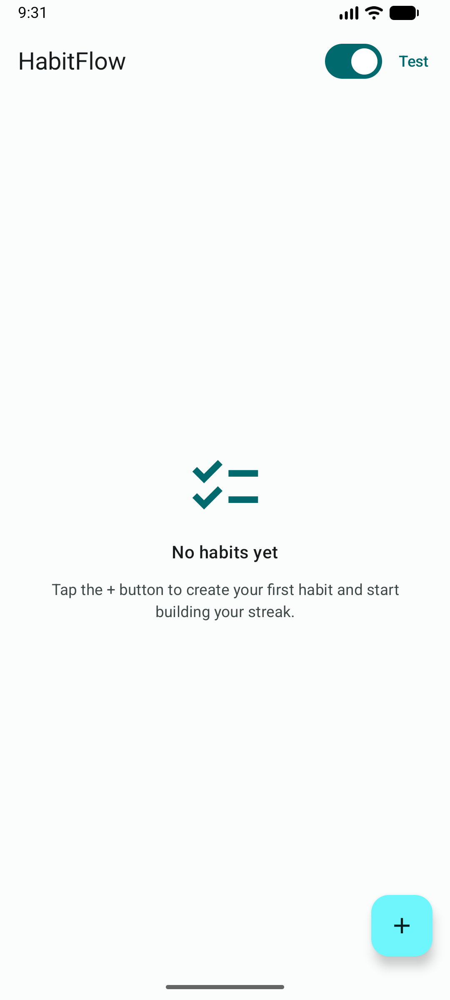
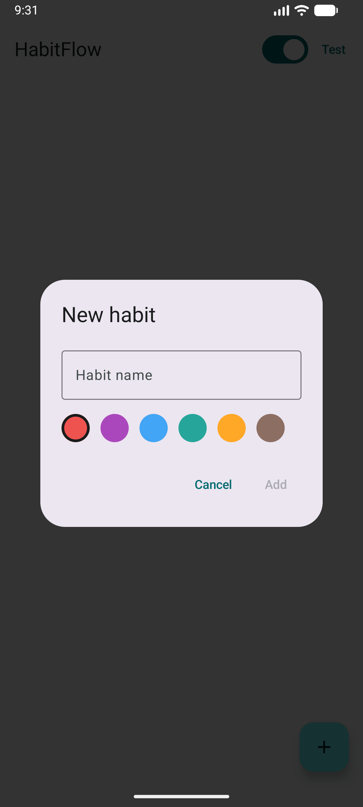
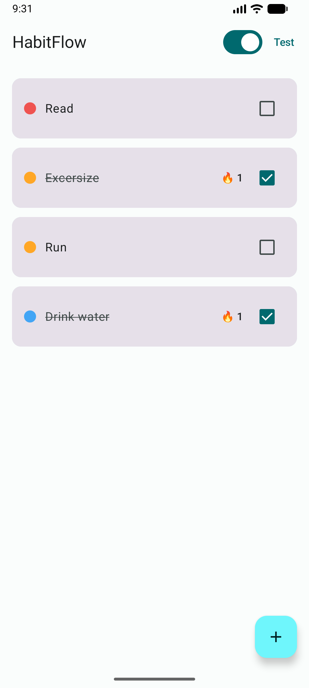
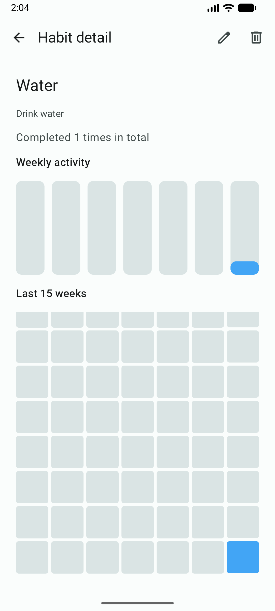
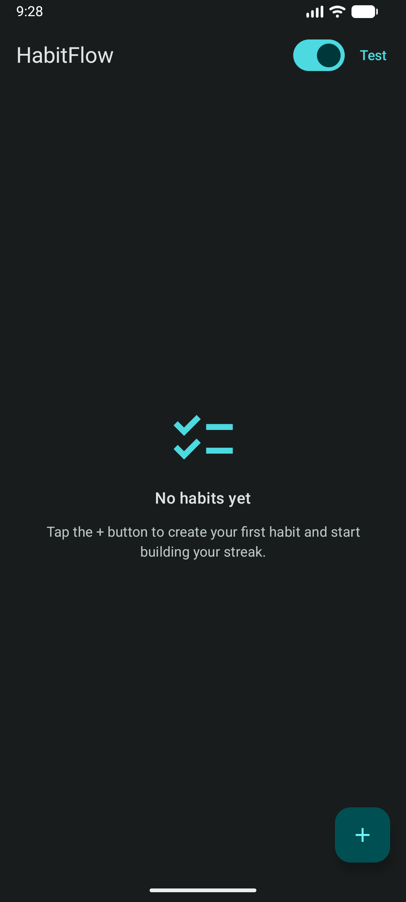
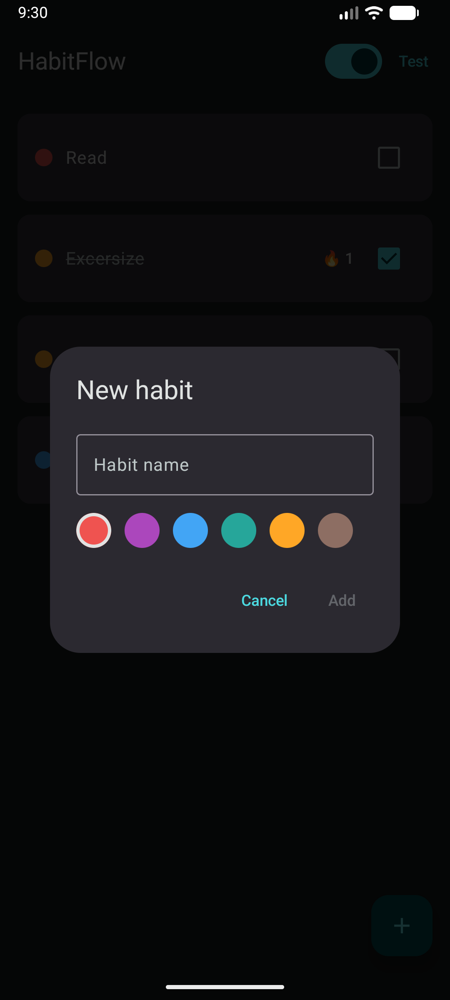
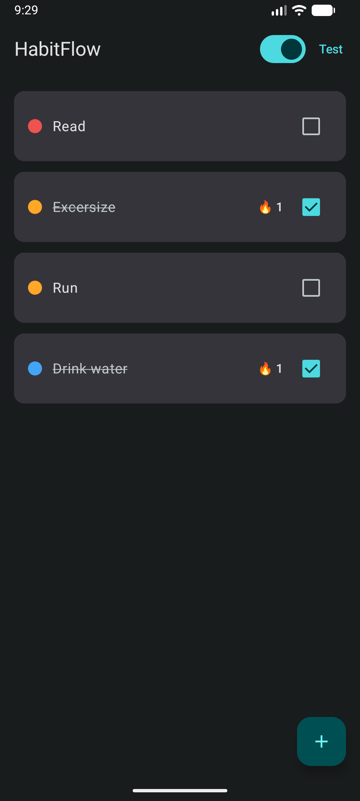
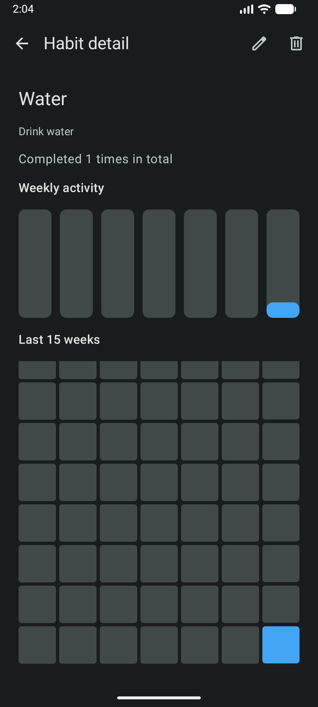

# HabitFlow

An offline-first habit tracking app for Android, built with Jetpack Compose and a clean, layered architecture. Track daily habits, build streaks, and get reminders — fully functional without a network connection.

## Screenshots

| Habit list | Add habit | Reminders |
|:---:|:---:|:---:|
|  |  |  |  |
|  |  |  |  |

*Light and dark themes, powered by a custom Material 3 color scheme.*

## Features

- Create habits with a custom name and color
- Mark habits complete each day, with automatic streak tracking
- Swipe to archive habits you no longer want to track
- Optional daily reminders via a scheduled background notification
- Fully offline — all data is stored locally
- Light and dark theme support

## Tech Stack

- **Language:** Kotlin
- **UI:** Jetpack Compose, Material 3
- **Architecture:** MVVM with a Data / Domain / UI layering
- **Dependency Injection:** Hilt
- **Persistence:** Room, DataStore
- **Background work:** WorkManager
- **Asynchrony:** Coroutines & Flow
- **Testing:** JUnit
- **CI:** GitHub Actions

## Architecture

The app follows a clean, layered architecture with a strict dependency direction (UI → Domain → Data):

- **UI** — Compose screens and ViewModels. Screen state is exposed as a `StateFlow` and collected with `collectAsStateWithLifecycle`.
- **Domain** — Pure Kotlin models, a `HabitRepository` interface, and use cases such as streak calculation. This layer has no Android or Room dependencies, which keeps the business logic easy to unit test.
- **Data** — Room database, DAO, DataStore preferences, the repository implementation, and mappers that convert database entities to domain models.

Because the UI depends only on the repository interface, the data source could be swapped without touching the UI or business logic.

### Highlights

- **Offline-first** — habits use client-generated UUIDs so records can be created without a server, avoiding ID collisions once sync is added.
- **Reactive** — a single `Flow` from Room drives the UI; completing or archiving a habit updates the list automatically.
- **Testable business logic** — streak calculation is an isolated use case with an injectable date provider, covered by unit tests.

## Roadmap

- [x] Mark habits as completed with daily streak tracking
- [x] Swipe to archive
- [x] Reminders via WorkManager
- [x] Unit tests for the streak logic
- [x] CI with GitHub Actions
- [x] Habit detail screen with a completion history calendar
- [x] Real Room migrations (replacing destructive fallback)
- [x] UI tests for the main flows

## Getting Started

1. Clone the repository
2. Open the project in Android Studio
3. Run the `app` configuration on an emulator or device (min SDK 24)

## Author

Yakup Aluç
[GitHub](https://github.com/yakupaluc1)